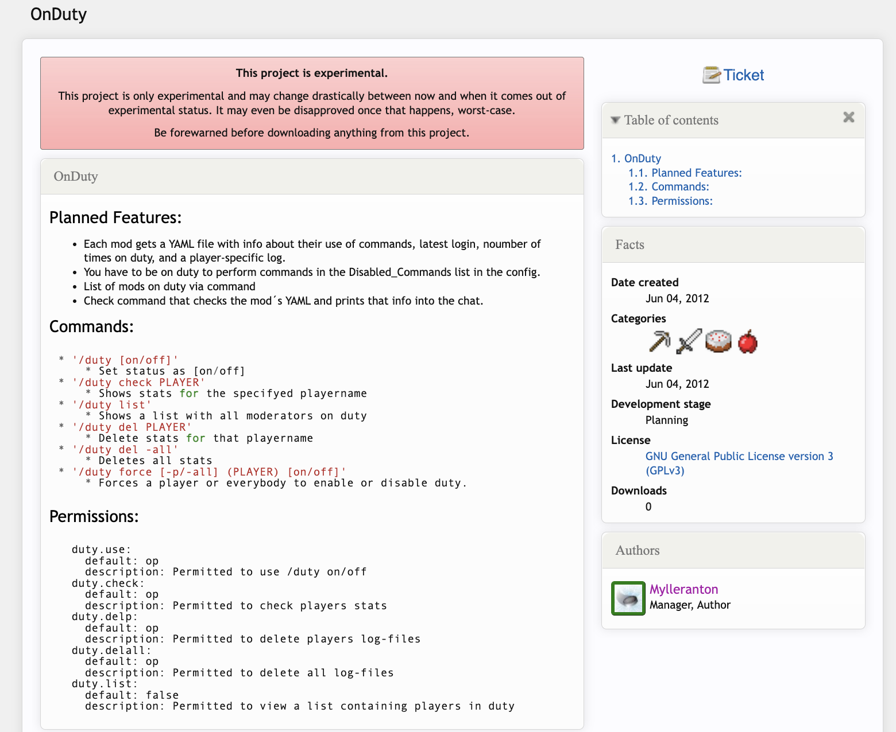

# OnDuty (conceptualised 2012-2013)
## What is (was) it?
OnDuty was a conceptualised Bukkit-plugin (*bukkit was one of the most popular Minecraft server implementations*) for tracking the efficiency of, and managing the staff (moderators) of a server. 

Its was initially conceptualised as a way for:
- General players to check which staff was online **and** was available (=*on duty*)at any given time
- Server moderators/staff to selectively be on/off-duty to allow for private odd-duty play time as well as managerial on-duty time
- Server administrators to keep track of the on-duty time of their staff to make informed decisions

OnDuty never left the experimental stage of development, and was hence never released in any way.

# Original documentation [on project site](https://dev.bukkit.org/server-mods/onduty)
Sadly, the project site seems to have died out, but here is a sneak peak of how it looked like along with the original documentation.


## Planned Features
- Each mod gets a YAML file with info about their use of commands, latest login, noumber of times on duty, and a player-specific log.
- You have to be on duty to perform commands in the Disabled_Commands list in the config.
- List of mods on duty via command
- Check command that checks the mod´s YAML and prints that info into the chat.

## Commands
- `/duty [on/off]` - Set status as [on/off]
- `/duty check PLAYER` - Shows stats for the specifyed playername
- `/duty list` - Shows a list with all moderators on duty
- `/duty del PLAYER` - Delete stats for that playername
- `/duty del -all` - Deletes all stats
- `/duty force [-p/-all] (PLAYER) [on/off]` - Forces a player or everybody to enable or disable duty.

## Permissions
```yml
  duty.use:
    default: op
    description: Permitted to use /duty on/off
  duty.check:
    default: op
    description: Permitted to check players stats
  duty.delp:
    default: op
    description: Permitted to delete players log-files
  duty.delall:
    default: op
    description: Permitted to delete all log-files
  duty.list:
    default: false
    description: Permitted to view a list containing players in duty
```